*s220058 Yang Xu
## Table of Contents
1. [Worksheet 1 - Ray Casting](#worksheet-1)
1. [Worksheet 2 - Ray-Object Intersection and Shading Diffuse Surfaces](#worksheet-2)
1. [Worksheet 3 - texture](#worksheet-3)
1. [Worksheet 4 - Triangle Meshes and Smooth Shading](#worksheet-4)
1. [Worksheet 5 - Measuring light (radiometry and photometry)](#worksheet-5)
1. [Worksheet 6 - Light Transport and Anti-Aliasing](#worksheet-6)
1. [Worksheet 7 - HDR and Monte Carlo Ray Tracing](#worksheet-7)
1. [Worksheet 8 - BRDF, Fresnel Reflectance, and Absorption](#worksheet-8)
1. [Worksheet 9 - Photon Mapping](#worksheet-9)
1. [Worksheet 10 - Rendering with Blender](#worksheet-10)
1. [Project: Ray tracing with OptiX](#project-OptiX)

<!--  
all the deliverables listed in the worksheets. 
relevant code snippets, 
rendered images, 
answers to the occasional questions in the worksheets. 
-->

<!-- ----------------------------------------------------------------------------------------------------------- -->
## Worksheet 1
---
| 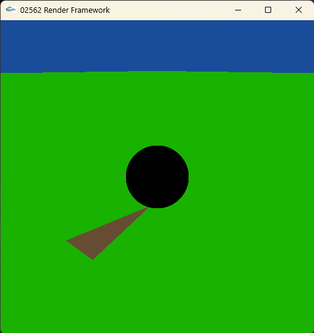 | 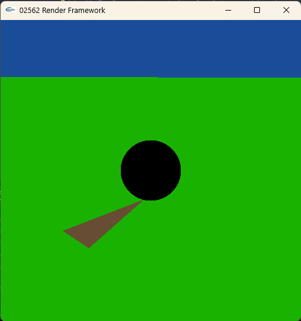 | 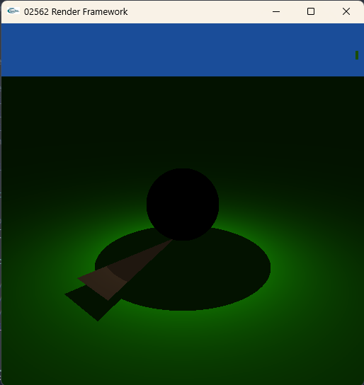 |
|:--:|:--:|:--:|
| <b>Fig.1 Preview</b> | <b>Fig.2 flat reflectance shading</b> | <b>Fig.3 Diffuse shading</b> |

As shown in Fig.1-3, ray generation, ray-object intersection and shading of diffuse surfaces all work as expected. Below are some relevant code snippets.


```cpp
float3 RayCaster::compute_pixel(unsigned int x, unsigned int y) const {
  Ray ray = scene -> get_camera() -> get_ray(make_float2(x, y) * win_to_ip + lower_left);
  HitInfo hit;

  if (scene -> closest_hit(ray, hit)) {
    return get_shader(hit) -> shade(ray, hit);
  } else {
    return get_background();
  }
}
```

```cpp
bool Triangle::intersect(const Ray& r, HitInfo& hit, unsigned int prim_idx) const {
  const float3 v0_minus_0 = v0 - r.origin;
  const float3 normal = cross((v1 - v0), (v2 - v0));
  const float omega_mul_n = dot(r.direction, normal);

  const float beta = dot(cross(v0_minus_0, r.direction), (v2 - v0)) / omega_mul_n;
  const float gamma = -dot(cross(v0_minus_0, r.direction), (v1 - v0)) / omega_mul_n;

  if (beta >= 0 && gamma >= 0 && beta + gamma <= 1) {
    const float t = dot(v0_minus_0, normal) / omega_mul_n;
    if (t > r.tmin && t < r.tmax) {
      hit.has_hit = true;
      hit.dist = t;
      hit.position = r.origin + t * r.direction;
      hit.shading_normal = normal;
      hit.geometric_normal = normal;
      hit.material = &material;
      return true;
    }
  }
  return false;
}
```

```cpp
float3 Lambertian::shade(const Ray& r, HitInfo& hit, bool emit) const {
  const float3 rho_d = get_diffuse(hit);
  float3 result, dir, L = make_float3(0.0f);

  for (int i = 0; i < lights.size(); i++) {
    if (lights[i]->sample(hit.position, dir, L)) {
      const float cos_angle = dot(hit.shading_normal, dir);
      if (cos_angle > 0)    result += rho_d * M_1_PIf * L * cos_angle;
    }
  }
  return result + Emission::shade(r, hit, emit);
}
```


<!-- ----------------------------------------------------------------------------------------------------------- -->
## Worksheet 2

<!-- 
shading of diffuse objects, mirror ball, glass ball, Phong ball, and glossy ball
Include relevant code snippets. Explain the helper function  and your final glossy shader (Glossy::shade).
-->

|  | 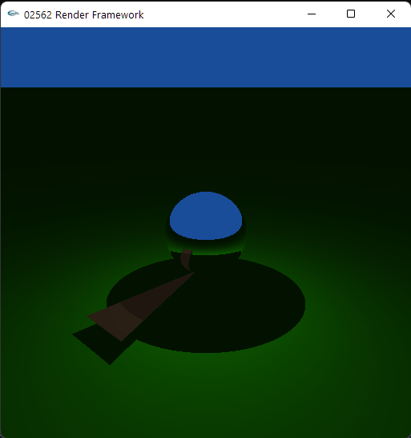 | 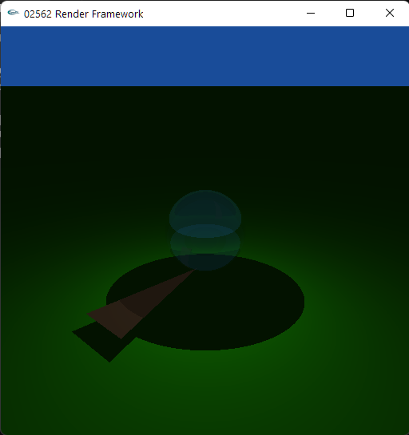 |
|:--:|:--:|:--:|
| <b>Fig.4 Diffuse shading</b> | <b>Fig.5 Mirror ball</b> | <b>Fig.6 Glass ball</b> |

| 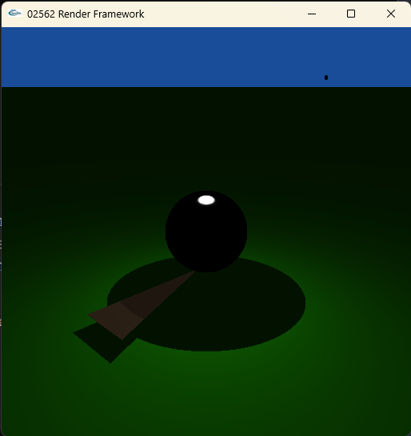 | 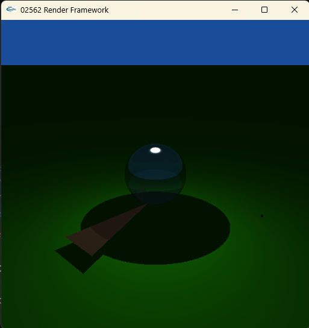 | 
|:--:|:--:|
| <b>Fig.7 Phong ball</b> | <b>Fig.8 Glossy ball</b> |

```cpp
float3 Glossy::shade(const Ray& r, HitInfo& hit, bool emit) const
{
  if (hit.trace_depth >= max_depth)
    return make_float3(0.0f);

  float R;
  Ray reflected, refracted;
  HitInfo hit_reflected, hit_refracted;
  tracer -> trace_reflected(r, hit, reflected, hit_reflected);
  tracer -> trace_refracted(r, hit, refracted, hit_refracted, R);

  return R * shade_new_ray(reflected, hit_reflected) + (1.0f - 2*R) * shade_new_ray(refracted, hit_refracted) + R * Phong::shade(r, hit, emit);
}
```
This function above calculates three parts: the reflection of a mirror ball, the refraction of a transparent ball and the highlight of phong model. All the shading are then weighted averaged.

The function `get_ior_out` is used to calculate the Refractive index of the material. if the ray hits the material from outside, then the normal is reversed for later calculation and the ior returned is the Refractive index of air, 1.0. Otherwise the material's Refractive index is returned.

```cpp
bool RayTracer::trace_reflected(const Ray& in, const HitInfo& in_hit, Ray& out, HitInfo& out_hit) const
{
  const float3 w_in = -normalize(in.direction);
  const float3 normal = in_hit.geometric_normal;

  const float cos = dot(w_in, normal);
  if (in_hit.has_hit) {

    out.direction = 2.0f * cos * normal - w_in;
    out.origin = in_hit.position;
    out.tmax = RT_DEFAULT_MAX;
    out.tmin = 1e-3;

    out_hit.ray_ior = in_hit.ray_ior;
    out_hit.trace_depth = in_hit.trace_depth + 1;
    
    return trace_to_closest(out, out_hit);
  } else  return false;
}

bool RayTracer::trace_refracted(const Ray& in, const HitInfo& in_hit, Ray& out, HitInfo& out_hit) const
{
  const float3 w_in = -normalize(in.direction);
  const float w_mul_n = dot(w_in, in_hit.geometric_normal);

  const bool refract_test = optix::refract(out.direction, in.direction, in_hit.geometric_normal, in_hit.ray_ior);

  if (in_hit.has_hit && refract_test) {
    out.origin = in_hit.position;
    out.tmax = RT_DEFAULT_MAX;
    out.tmin = 1e-3;

    out_hit.ray_ior = in_hit.ray_ior;
    out_hit.trace_depth = in_hit.trace_depth + 1;

    return trace_to_closest(out, out_hit);
  }

  return false;
}
```
```cpp
float3 Phong::shade(const Ray& r, HitInfo& hit, bool emit) const
{
  float3 rho_d = get_diffuse(hit);
  float3 rho_s = get_specular(hit);
  float s = get_shininess(hit);

  float3 dir, L, result = make_float3(0);
  const float3 coef_1 = rho_d * M_1_PIf;
  const float3 coef_2 = rho_s * M_1_PIf * (s + 2) / 2;
  const float3 w_r = r.direction - 2 * dot(r.direction, hit.shading_normal) * hit.shading_normal;
  const float3 w_0 = normalize(r.origin - hit.position);

  for (int i = 0; i < lights.size(); i++) {
    if (lights[i]->sample(hit.position, dir, L)) {
      const float angle = dot(dir, hit.shading_normal);
      if (angle > 0)
        result += (coef_1 + coef_2 * pow(fmax(dot(dir, w_r), 0.0), s)) * L * angle;
    }
  }

  return result + Emission::shade(r, hit, emit);
}
```


<!-- ----------------------------------------------------------------------------------------------------------- -->
## Worksheet 3

<!-- 
Renderings of the default scene with a textured plane 
(e.g. using look-up of nearest texel, 
bilinear magnification filtering,
and using nearest texel or bilinear filtering with a 10-fold magnified texture). 
Rendering of the default scene with a different choice of texture. 
In addition, provide the explanations and comparisons mentioned above. 
Include relevant code snippets. Please insert all this into your lab journal. -->
<!-- Explain how texture colour is used in a rendering. Look at the functions in the file Textured.cpp and consider how these functions are used in the shade functions in Emission.h and Lambertian.cpp. -->


> In the function `get_emission`, if the texture is not set, then it goes to the function `get_emmision` in `Emission.h`, which will return the material's ambient color; Then if there is a texture loaded, the emission will be reduced by being divided by the diffuse parameter of the material. And it will be multiplied with texture color linearly sampled. The reason of the division is that it can balance the overall color of direct and indirect lighting, while this part still requires more thoughts.
> 
> In the function `get_diffuse`, if the texture is not set, the material's diffuse value will be returned. If the texture is loaded, the linearly sampled texture color is returned. Then both two of these functions will return value to `Emission.h` and `Lambertian.cpp`.

| 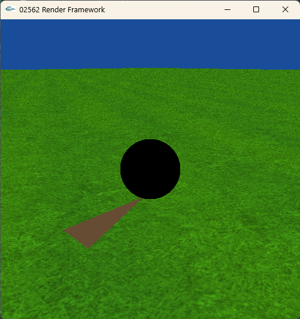 | 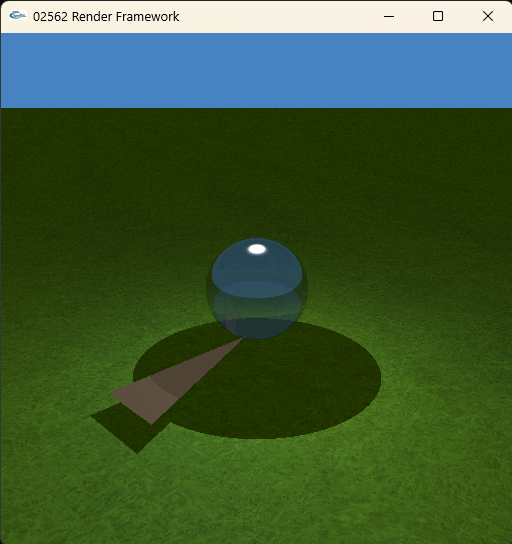 | 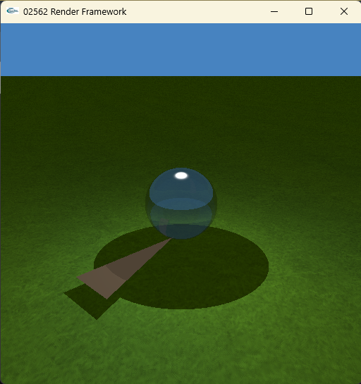 |
|:--:|:--:|:--:|
| <b>Fig.9 Preview</b> | <b>Fig.10 look-up of nearest</b> | <b>Fig.11 bilinear filter</b> |
| 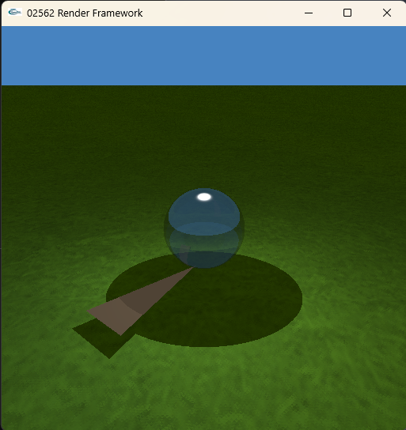 | 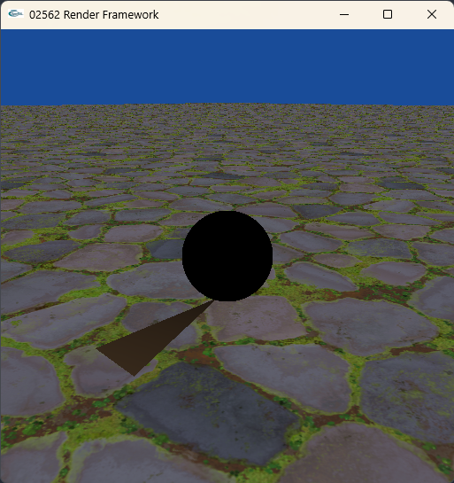 | 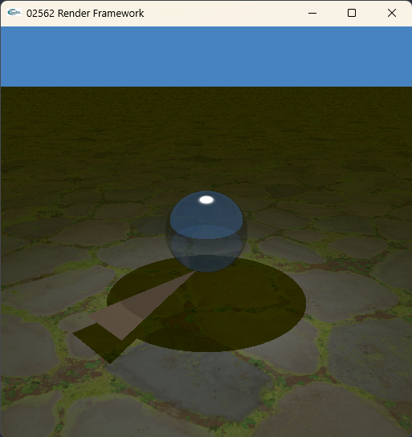 |
| <b>Fig.12 bilinear 10-fold</b> | <b>Fig.13 another texture-1</b> | <b>Fig.14 another texture-2</b> |

*texture source: https://www.textures.com/download/PBR1079/143527*

> Compared to preview, the nearest sampler makes the texture more clear as it chooses the color for every pixel.
> 
> Compared to nearest sampler, the linear look-up smooth the textures, scaling the textures would cause those close to the eye position to sample more densely. A bigger local patch of pixels would choose close colors, which is not perfect for grassland.

```cpp
void Plane::get_uv(const float3& hit_pos, float& u, float& v) const 
{ 
  // x = x0 + u~b1 + v~b2,
  // u = b1(x-x0)
  // v = b2(x-x0)
  u = dot(get_tangent(), hit_pos - get_origin()) * tex_scale;
  v = dot(get_binormal(), hit_pos - get_origin()) * tex_scale;
}
```

```cpp
float4 Texture::sample_nearest(const float3& texcoord) const
{
  if(!fdata)
    return make_float4(0.0f);

  const float s = texcoord.x - floor(texcoord.x);
  const float t = texcoord.y - floor(texcoord.y);
   
  const float a = s * width;
  const float b = t * height;

  const int U = static_cast <int>  (a + 0.5f) % width;
  const int V = static_cast <int>  (b + 0.5f) % height;
  const int i = U + (height - V - 1) * width;

  return fdata[i];
}

float4 Texture::sample_linear(const float3& texcoord) const
{
  if(!fdata)
    return make_float4(0.0f);

  const float s = texcoord.x - floor(texcoord.x);
  const float t = texcoord.y - floor(texcoord.y);

  const float a = s * width;
  const float b = t * height;

  const int U = static_cast <int> (a);
  const int V = static_cast <int> (b);
  const float c1 = a - U;
  const float c2 = b - V;

  const int i00 = U + (height - V - 1) * width;
  const int i01 = U + (height - (V + 1) % height - 1) * width;
  const int i10 = (U + 1) % width + (height - V - 1) * width;
  const int i11 = (U + 1) % width + (height - (V + 1) % height - 1) * width;

  return bilerp(fdata[i00], fdata[i01], fdata[i10], fdata[i11], c1, c2);
}
```


<!-- ----------------------------------------------------------------------------------------------------------- -->
## Worksheet 4
<!-- Renderings of the Cornell box, the Utah teapot, and the Stanford bunny. 
Also provide the explanations, comparisons, and performance measurements mentioned above. Include relevant code snippets. Please insert all this into your lab journal. -->

| 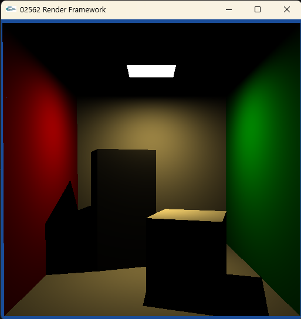 | 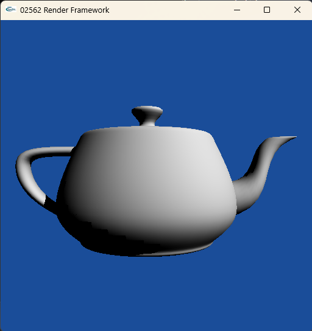 | 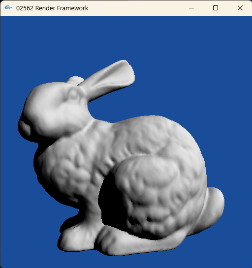 |
|:--:|:--:|:--:|
| <b>Fig.15 Cornell Box</b> | <b>Fig.16 Teapot</b> | <b>Fig.17 Stanford bunny</b> |

> The cornell box works well with mesh intersection and arealight implemented. 
> 
> In `BspTree.cpp`, for the `closest_hit` function, the closest plane is found first and `tmax` set. Then `intersect_min_max` can determine whether this ray intersects the bounding box of the objects. If intersected, `intersect_node` will use the BSP tree algorithm to find exactly the place of hit if exists. Then the function will return `has_hit`.
>
> For the `any_hit` function, `any_plane` function is called first and return true if there is. Ohterwise, it goes into the same path as the last part.


| Models                  | Number of triangles | Time for looping |  Time for BSP |
|:--:|:--:|:--:|:--:|
| Cornell box and blocks: | 36    | 0.025s  | 0.01s  |
| Utah teapot:            | 6320  | 5.43s   | 0.019s |
| Stanford bunny          | 69451 | 68.457s | 0.032s |

<!-- Find the speed-up factors and describe the relation between number of triangles and speed-up factors for looping versus axis-aligned BSP tree. -->
> When there is no BSP acceleration, the time would be around 0.001 of the number of triangles. When using speed-up, we can clearly see that time is shortened, which is under the effect of `log(n)`. With helper functions, it is faster.


```cpp
bool TriMesh::intersect(const Ray& r, HitInfo& hit, unsigned int prim_idx) const
{
  const uint3& face = geometry.face(prim_idx);

  const float3 v0 = geometry.vertex(face.x);
  const float3 v1 = geometry.vertex(face.y);
  const float3 v2 = geometry.vertex(face.z);
  float3 normal = make_float3(0);
  float t = 0;
  float beta = 0.0, gamma = 0.0;
  
  const bool test = optix::intersect_triangle(r, v0, v1, v2, normal, t, beta, gamma);

  if (test) {
    hit.has_hit = true;
    hit.material = &materials[mat_idx[prim_idx]];
    hit.dist = t;
    hit.position = r.origin + hit.dist * r.direction;
    hit.geometric_normal = normalize(normal);

    if (has_normals()) {
      // extract normals 
      const uint3& f = normals.face(prim_idx);
      const float3 n1 = normals.vertex(f.x);
      const float3 n2 = normals.vertex(f.y);
      const float3 n3 = normals.vertex(f.z);
      hit.shading_normal = normalize((1 - beta - gamma) * n1 + beta * n2 + gamma * n3);
    } else {
      hit.shading_normal = normalize(normal);
    }

    return true;
  }

  return false;
}
```

```cpp
bool AreaLight::sample(const float3& pos, float3& dir, float3& L) const {
	const IndexedFaceSet& normals = mesh->normals; 
	L = make_float3(0.0f);

	const float3 light_pos = mesh->compute_bbox().center();
	const float3 vec = light_pos - pos;
	dir = normalize(vec);

	float3 l_e = make_float3(0);

	for (int i = 0; i < mesh->get_no_of_primitives(); i++)
	{
		const uint3 face = normals.face(i);
		const float3 face_normal = normalize(normals.vertex(face.x) + normals.vertex(face.y) + normals.vertex(face.z));
		l_e += dot(-dir, face_normal) * get_emission(i) * mesh->face_areas[i];
	}
	L = 1 * l_e / pow(length(vec), 2);

	if (shadows) {
		HitInfo hit;
		Ray ray(pos, dir, 0, 1e-3, RT_DEFAULT_MAX);
		return !tracer->trace_to_closest(ray, hit);
  }

	return true;
}
```

```cpp
bool BspTree::closest_hit(Ray& r, HitInfo& hit) const
{
  closest_plane(r, hit);
  if (intersect_min_max(r)) {
    intersect_node(r, hit, *root);
  }
  return hit.has_hit;
}

bool BspTree::any_hit(Ray& r, HitInfo& hit) const
{
  if (any_plane(r, hit))    return true;
  else if (intersect_min_max(r)) {
    intersect_node(r, hit, *root);
  }
  return hit.has_hit;
}
```


<!-- ----------------------------------------------------------------------------------------------------------- -->
## Worksheet 5
- part 1 :  

$$
f = \frac{c}{\lambda} \\
E = hf \\
number = \frac{w * efficiency}{E} = 1.26e+19
$$

- part 2 :

$$
radiant\ reflux: \phi = 1*VC = 1.68 W\\
Radiant\ intensity: I = \frac{\phi}{\Omega} = 0.134 \  W/sr\\
Radiant\ exitance : M = \frac{\phi}{A} = 1337 \ W/m^2\\
Emitted\ energy: Q= \phi  t = 504 \ J \\
$$
- part 3 :
$$
E = \frac{\phi}{4\pi} \frac{cos\theta}{r^2} = 0.134\  W/ m^2
$$

- part 4 :
$$
Irradiance = \frac{\phi}{4\pi} \frac{cos\theta}{r^2} = \frac{W * 0.2 }{4\pi} \frac{cos\theta}{r^2} = 0.796 W/m^2 \\
Illuminance = Irradiance * 685 * V(\lambda) = 54.51\ lm/ m^2 
$$

- part 5:
$$
I_x  = \frac{I_s d_x^2}{d_s^2} = 138.00\  cd
$$

- part 6:
$$
B = L\pi = 15707 \ W/m^2 \\
\phi = LA\pi = 157 W
$$

- part 7:
$$
M = L\pi = 18850 \ W/m^2 \\
\phi = LA\pi = 188.50 W
$$


<!-- ----------------------------------------------------------------------------------------------------------- -->
## Worksheet 6
<!-- Renderings of the default scene using different pixel subdivision levels. 
      Renderings of the Cornell box with anti-aliased edges and including indirect illumination. 
      Include relevant code snippets, a table of render times, and list the number of samples per pixel. 
      Provide the explanations and answers that we ask for in the assignment text. 
      Please insert all this into your lab journal -->

<!-- Describe how the pixel subdivision level is changed while the program is running. -->
> When `+-` is clicked, the `increment_pixel_subdivs` and `decrement_pixel_subdivs` functions will be called in RayCaster.

<!-- Explain what the function compute_jitters stores in the vector array jitter. Explain how many sub-pixels we get for each pixel when the pixel subdivision level is subdivs = s. -->
> What jitter stores is an vector of 2d floats. It constructs the subdivision grid, and randomly sample from those grids in each sub-pixel. Then the values are transformed to the same as what we need in raycaster.  
> when the pixel subdivision level is $s$, there are $s^2$ sub-pixels we get for each pixel.

```cpp
float3 RayCaster::compute_pixel(unsigned int x, unsigned int y) const
{
  float3 result = make_float3(0.0);
  bool isHit = false;

  for (unsigned int i = 0; i < subdivs; ++i) {
    for (unsigned int j = 0; j < subdivs; ++j) {
      Ray ray = scene->get_camera()->get_ray(make_float2(x, y) * win_to_ip + lower_left + jitter[i * subdivs + j]);
      HitInfo hit;

      if (scene -> closest_hit(ray, hit)) {
        result += get_shader(hit)->shade(ray, hit);
        isHit = true;
      } else {
        result += get_background(ray.direction);
      }
    }
  }

  return result / (subdivs * subdivs);
}
```

<!-- Render the default scene using different pixel subdivision levels. 
Record the render times. Answer the following questions: -->
<!-- What is the relationship between the pixel subdivision level and the render time? -->
<!-- What is the relationship between the pixel subdivision level and the aliasing error in the render result? -->
|  |  | 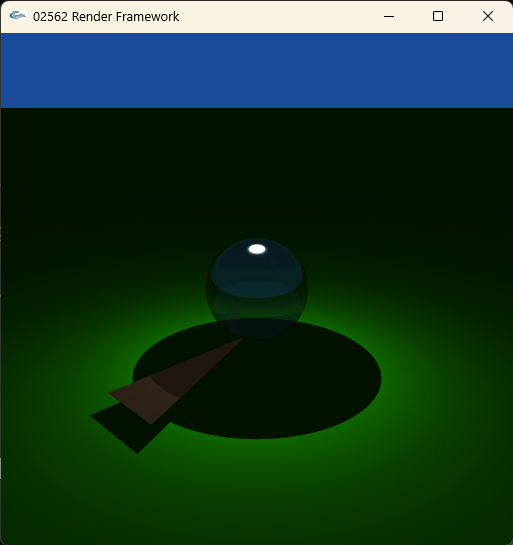 |  |
|:--:|:--:|:--:|:--:|
| <b>Fig.18 $s = 1$</b> | <b>Fig.19 $s=2$</b> | <b>Fig.20 $s=3$</b> |<b>Fig.21 $s=4$</b> |

| Subdivision level        | Samples per pixel | Time  |  
|:--:|:--:|:--:|
| 1 |   1  |  0.023 s | 
| 2 |   4  |  0.089 s | 
| 3 |    9 | 0.18 s  | 
| 4 |   16  | 0.315 s  | 
> Clearly, the higher the subdivision level, the longer the render time is, and the less the aliasing error.

<!-- Note the number of samples per pixel explain how the progressive approach achieves anti-aliasing. -->

|  | 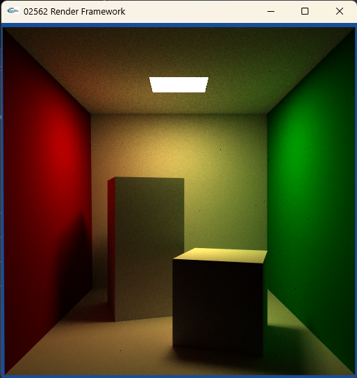 | 
|:--:|:--:|
| <b>Fig.22 Cornell with anti-aliasing</b> | <b>Fig.23 Cornell with indirect illumination </b> |

> The number of samples per pixel stay as 1. The progressive approach will execute `PathTracer::update_pixel`, which traces the rays again and use a monte carlo estimator to progressively reduce the noise. 

```cpp
inline optix::float3 sample_cosine_weighted(const optix::float3& normal)ray(hit
{
  const double xi1 = mt_random_half_open();
  const double xi2 = mt_random_half_open();

  const float theta = acos(sqrt(1-xi1));
  const float phi = 2 * M_PIf * xi2;

  const optix::float3 wij_ = optix::make_float3(cos(phi)*sin(theta), sin(phi)*sin(theta), cos(theta));
  const float sgn_nz = copysign(1.0, normal.z);

  const optix::float3 wij = wij_.x * optix::make_float3(1 - pow(normal.x, 2) / (1 + abs(normal.z)), 
                                                        -normal.x * normal.y / (1 + abs(normal.z)), 
                                                        -normal.x * sgn_nz)
                          + wij_.y * optix::make_float3(-normal.x * normal.y / (1 + abs(normal.z)) / sgn_nz, 
                                                        1 - pow(normal.y, 2) / (1 + abs(normal.z)) / sgn_nz, 
                                                        -normal.y)  
                          + wij_.z * normal;
  return wij;
}
```

```cpp
float3 MCGlossy::shade(const Ray& r, HitInfo& hit, bool emit) const
{
  if(hit.trace_depth >= max_depth)
    return make_float3(0.0f);

  float3 rho_d = get_diffuse(hit);
  float3 result = make_float3(0.0f);

  // Either diffuse reflection or absorption
  const double xi = mt_random_half_open();
  const float p_diffuse = (rho_d.x + rho_d.y + rho_d.z) / 3;
  const float p_absorption = 1 - p_diffuse;

  if (xi < p_diffuse) {
    Ray ray(hit.position, normalize(sample_cosine_weighted(hit.shading_normal)), 0, 1e-4);
    HitInfo hit2;
    
    if (tracer -> trace_to_closest(ray, hit2)) {
      result += shade_new_ray(ray, hit2, false) * rho_d;
    }
  }
  return result + Lambertian::shade(r, hit, emit);
}
```


<!-- ----------------------------------------------------------------------------------------------------------- -->
## Worksheet 7
<!-- Cornell box image with blocks that cast soft shadows, 
and an image with mirror and glass balls instead of the blocks. 
An image of a bunny or a teapot placed in a photographed environment where it casts soft shadows onto the ground. 
Please insert code snippets and images into your lab journal. -->

| 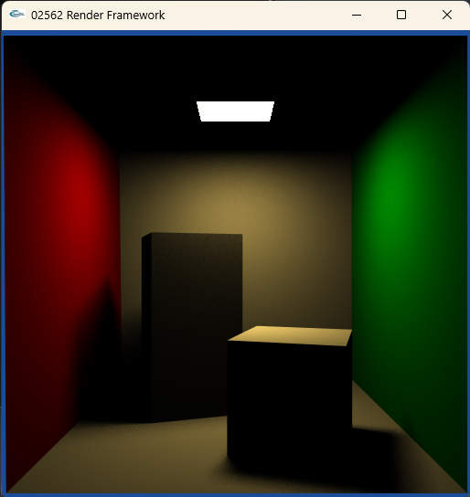 | 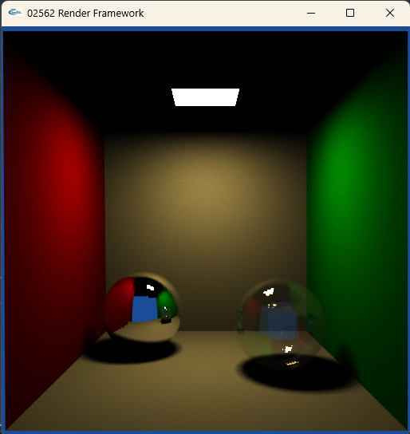 | 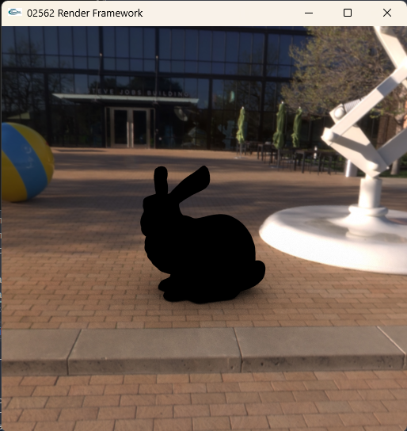 |
|:--:|:--:|:--:|
| <b>Fig.24 Cornell blocks with soft shadows</b> | <b>Fig.25 Cornell balls with soft shadows</b> | <b>Fig.26 Bunny on Holdout</b> |


```cpp
bool AreaLight::sample(const float3& pos, float3& dir, float3& L) const
{
	const IndexedFaceSet& normals = mesh->normals; 
	L = make_float3(0.0f);

	const int item = floor(mesh->get_no_of_primitives() * mt_random_half_open());

	const float xi1 = mt_random_half_open();
	const float xi2 = mt_random_half_open();
	const float u = 1 - sqrt(xi1);
	const float v = (1-xi2) * sqrt(xi1);
	const float w = 1 - v - u;

	// get random position and normal
	const uint3& face = mesh->geometry.face(item);
	const float3 v0 = mesh->geometry.vertex(face.x);
	const float3 v1 = mesh->geometry.vertex(face.y);
	const float3 v2 = mesh->geometry.vertex(face.z);
	const uint3& normal_face = mesh->normals.face(item);
	const float3 n0 = normals.vertex(normal_face.x);
	const float3 n1 = normals.vertex(normal_face.y);
	const float3 n2 = normals.vertex(normal_face.z);

	const float3 x_lj = u * v0 + v * v1 + w * v2;
	const float3 n_lj = normalize(u * n0 + v * n1 + w * n2);

	const float3 w_j = normalize(x_lj - pos);

	L = get_emission(item) * 1 * dot(n_lj, -w_j) / pow(length(x_lj - pos), 2) * mesh->face_areas[item] * mesh->get_no_of_primitives();
	dir = w_j;

	if (shadows) {
		HitInfo hit;
		Ray ray(pos, dir, 1, 1e-3, length(x_lj - pos) - 1e-3);
		return !tracer->trace_to_any(ray, hit);
	}

	return true;
}
```

```cpp
float3 Holdout::shade(const Ray& r, HitInfo& hit, bool emit) const
{
  // tracing rays in directions sampled on the hemisphere over each surface point.
  float visible = 0.0;
  for (int i = 0; i < samples; i++)
  {
    const float3 sample_dir = sample_cosine_weighted(hit.shading_normal);

    Ray ray(hit.position, sample_dir, 0, 1e-4, RT_DEFAULT_MAX);
    HitInfo hitinfo;

    const bool result = tracer->trace_to_closest(ray, hitinfo);
    if (!hitinfo.has_hit)     visible++;
  }
  
  return visible/samples * tracer->get_background(r.direction);
}
```


<!-- ----------------------------------------------------------------------------------------------------------- -->
## Worksheet 8
<!-- Renderings of the default scene (e.g. using Fresnel reflectance with highlights, with and without absorption). Compare to previous results. Include relevant code snippets. Please insert all this into your lab journal. -->

| 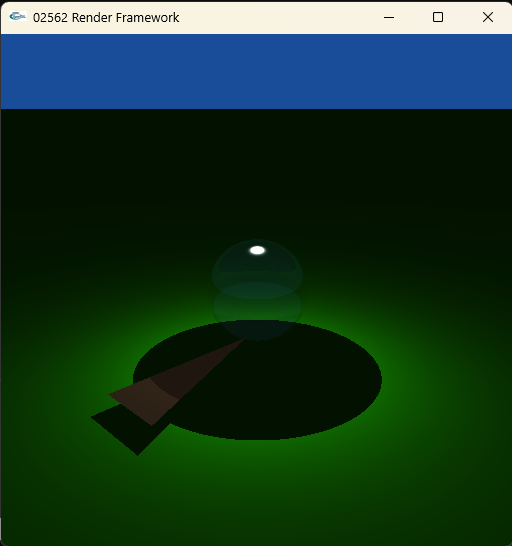 | 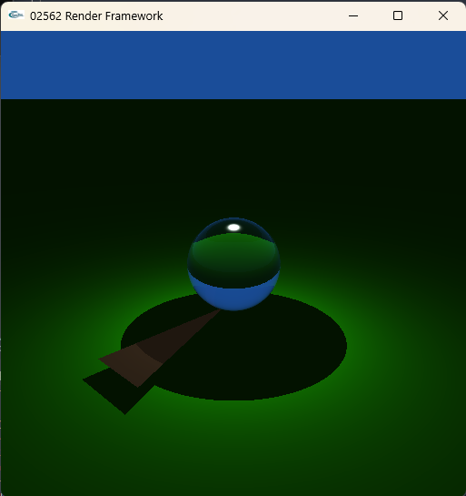 | 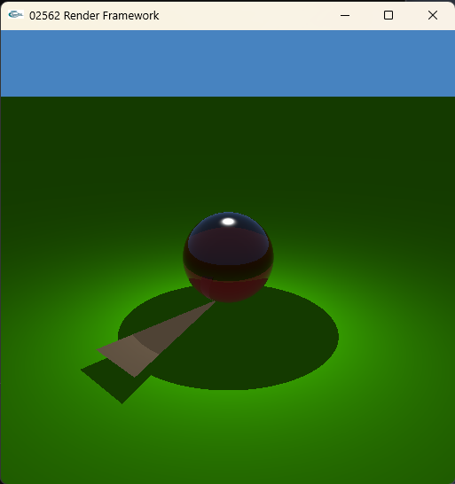 |
|:--:|:--:|:--:|
| <b>Fig.27 $R = 0.1$</b> | <b>Fig.28 Fresnel reflectance</b> | <b>Fig.29 Fresnel reflectance with absorption</b> |

> Compared to when $R$ is a fixed value, Fresnel reflectance makes the rendering of the ball more bright and shiny, reflecting more of the environment around it. After using Bouguer’s law of exponential attenuation, the absorption rendering shows more of the ball's color.

```cpp
inline float fresnel_r_s(float cos_theta1, float cos_theta2, float ior1, float ior2)
{
  return (ior1 * cos_theta1 - ior2 * cos_theta2) / (ior1 * cos_theta1 + ior2 * cos_theta2);
}

inline float fresnel_r_p(float cos_theta1, float cos_theta2, float ior1, float ior2)
{
  return (ior2 * cos_theta1 - ior1 * cos_theta2) / (ior2 * cos_theta1 + ior1 * cos_theta2);
}

inline float fresnel_R(float cos_theta1, float cos_theta2, float ior1, float ior2)
{
  return (pow(fresnel_r_s(cos_theta1, cos_theta2, ior1, ior2), 2) + pow(fresnel_r_p(cos_theta1, cos_theta2, ior1, ior2), 2)) / 2.0;
}
```

```cpp
float3 Volume::shade(const Ray& r, HitInfo& hit, bool emit) const
{
  return get_transmittance(hit);
}

float3 Volume::get_transmittance(const HitInfo& hit) const
{
  float3 T_r = make_float3(0.0);

  if (hit.material)
  {
    // use rho_d as the absorption coef
    const float3 rho_d = make_float3(hit.material->diffuse[0], hit.material->diffuse[1], hit.material->diffuse[2]);
    const float x = rho_d.x != 0 ? 1 / rho_d.x - 1 : 0;
    const float y = rho_d.y != 0 ? 1 / rho_d.y - 1 : 0;
    const float z = rho_d.z != 0 ? 1 / rho_d.z - 1 : 0;

    T_r = optix::expf(-make_float3(x, y, z) * hit.dist);
  }

  return T_r;
}
```


```cpp
float3 GlossyVolume::shade(const Ray& r, HitInfo& hit, bool emit) const
{
  if (hit.trace_depth >= max_depth)
    return make_float3(0.0f);

  float R;
  Ray reflected, refracted;
  HitInfo hit_reflected, hit_refracted;
  tracer->trace_reflected(r, hit, reflected, hit_reflected);
  tracer->trace_refracted(r, hit, refracted, hit_refracted, R);

  const float3 T_r = Volume::shade(r, hit, emit);

  // phong model
  const float3 rho_s = get_specular(hit);
  const float s = get_shininess(hit);

  float3 dir, L, result = make_float3(0);
  const float3 coef_2 = rho_s * M_1_PIf * (s + 2) / 2;
  const float3 w_r = r.direction - 2 * dot(r.direction, hit.shading_normal) * hit.shading_normal;
  const float3 w_0 = normalize(r.origin - hit.position);

  for (int i = 0; i < lights.size(); i++) {
    if (lights[i]->sample(hit.position, dir, L)) {
      const float angle = dot(dir, hit.shading_normal);
      if (angle > 0)
        result += (coef_2 * pow(fmax(dot(dir, w_r), 0.0), s)) * L * angle;
    }
  }

  result = result + Emission::shade(r, hit, emit);

  if (dot(r.direction, hit.geometric_normal) > 0)
    return T_r * (R * shade_new_ray(reflected, hit_reflected) + (1 - R) * shade_new_ray(refracted, hit_refracted) + R * result);
  else
    return R * shade_new_ray(reflected, hit_reflected) + (1 - R) * shade_new_ray(refracted, hit_refracted) + R * result;
}
```


<!-- ----------------------------------------------------------------------------------------------------------- -->
## Worksheet 9
<!-- Renderings of the default scene 
(e.g. caustics illumination only and the complete result with and without absorption) 
and a rendering of the photons in the caustics photon map as dots. 
Include relevant code snippets 
and render settings: number of photons in the map, number of photons in each radiance estimate, and number of samples per pixel. 
Please insert all this into your lab journal. -->


| 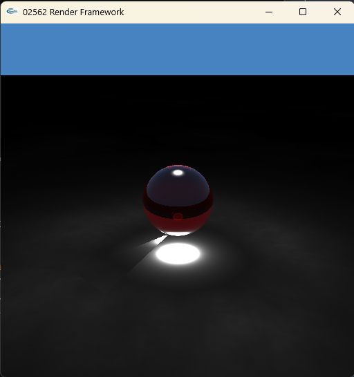 | 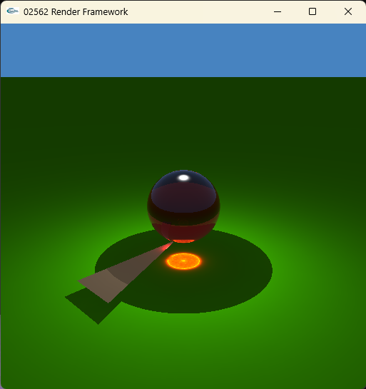 | 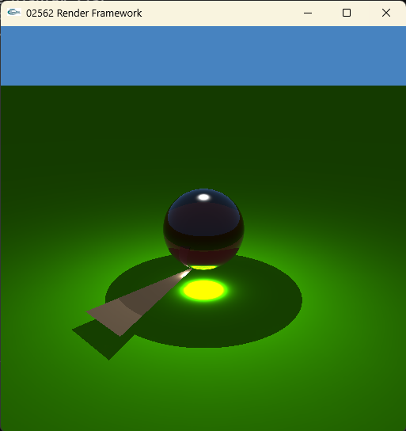 |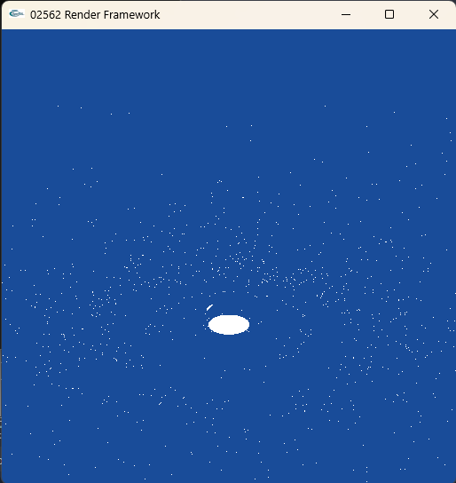 |
|:--:|:--:|:--:|:--:|
| <b>Fig.30 caustics illumination</b> | <b>Fig.31 with absorption</b> | <b>Fig.32 without absorption</b> | <b>Fig.33 rendering of the photons</b> |

> The number of photons in the map, number of photons in each radiance estimate, and number of samples per pixel are respectively 20007, 50 and 1.

```cpp
bool PointLight::emit(Ray& r, HitInfo& hit, float3& Phi) const
{
  float3 direction = make_float3(0.0);
  do
  {
    direction.x = 2.0f * mt_random() - 1.0f;
    direction.y = 2.0f * mt_random() - 1.0f;
    direction.z = 2.0f * mt_random() - 1.0f;
  } while (dot(direction, direction) > 1.0f);
  direction = normalize(direction);

  r = make_Ray(light_pos, direction, 0, 1e-3, RT_DEFAULT_MAX);
  if (tracer->trace_to_closest(r, hit)) {
    Phi = intensity * 4.0 * M_PIf;
    return true;
  }

  return false;
}
```   
```cpp
void ParticleTracer::trace_particle(const Light* light, const unsigned int caustics_done)
{
  if(caustics_done)
    return;

  // Shoot a particle from the sampled source
  Ray r;
  HitInfo hit;
  float3 phi = make_float3(0.0); 
  if (!light->emit(r, hit, phi))  return;
  if (!scene->is_specular(hit.material))  return;
  
  // Forward from all specular surfaces
  while(scene->is_specular(hit.material) && hit.trace_depth < 500)
  {
    switch(hit.material->illum)
    {
    case 3:  // mirror materials
      {
        Ray reflected;
        HitInfo reflected_hit;
        
        const bool res = trace_reflected(r, hit, reflected, reflected_hit);
        if (res == false)   return;
        else {
          r = reflected;
          hit = reflected_hit;
        }
      }
      break;
    case 11: // absorbing volume
    case 12: // absorbing glossy volume
      {
        // Handle absorption here (Worksheet 8) 
        if (dot(r.direction, hit.shading_normal) > 0) {
          phi *= get_transmittance(hit);
        }
      }
    case 2:  // glossy materials
    case 4:  // transparent materials
      {
        // Forward from transparent surfaces here
        Ray new_ray;
        HitInfo new_hit;
        bool res;
        float f = 0.0;

        res = trace_refracted(r, hit, new_ray, new_hit, f);
        if (mt_random() < f) {
          new_hit = HitInfo();
          res = trace_reflected(r, hit, new_ray, new_hit);
        }
        
        if (new_hit.has_hit == false)   return;
        else {
          r = new_ray;
          hit = new_hit; 
        }
      }
      break;
    default: 
      return;
    }
  }
  caustics.store(phi, hit.position, -r.direction);
}
```


```cpp
float3 PhotonCaustics::shade(const Ray& r, HitInfo& hit, bool emit) const
{
  const float3 rho_d = get_diffuse(hit);
  
  const float3 irradiance = tracer->caustics_irradiance(hit, max_dist, photons);
  const float kernel = pow(length(hit.position - r.origin) / 0.3, 2.0) < 1 ? 1/M_PIf : 1 / M_PIf;
  const float3 radiance = rho_d * irradiance * M_PIf * kernel;

  return radiance + Lambertian::shade(r, hit, emit);
  //return irradiance;
}
```

<!-- ----------------------------------------------------------------------------------------------------------- -->
## Worksheet 10
<!-- Metallic sphere and glass cube in a photographed environment. One or more other objects placed in a photographed environment and shaded with a realistic material shader. Provide the explanation and the discussion listed above. -->

| 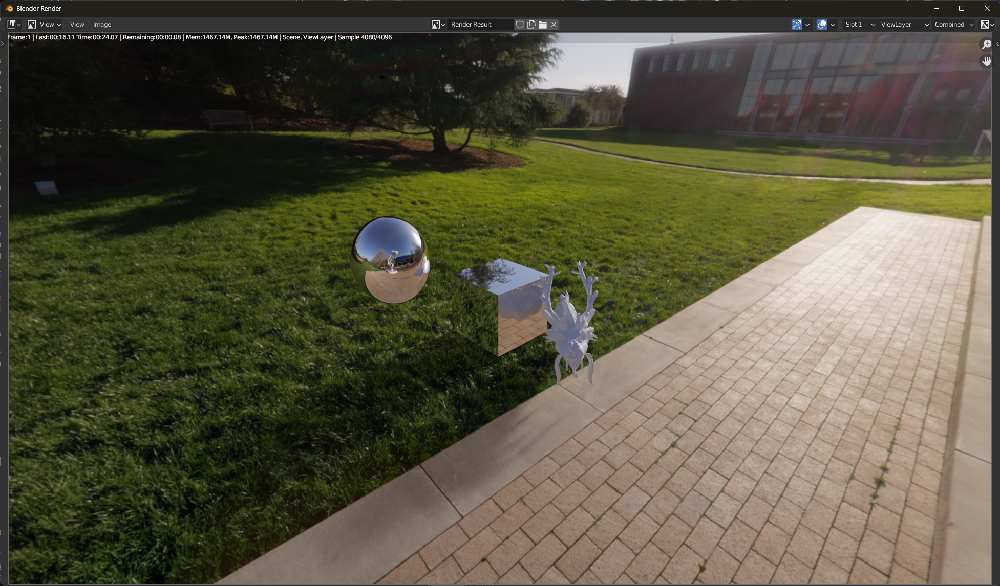 | 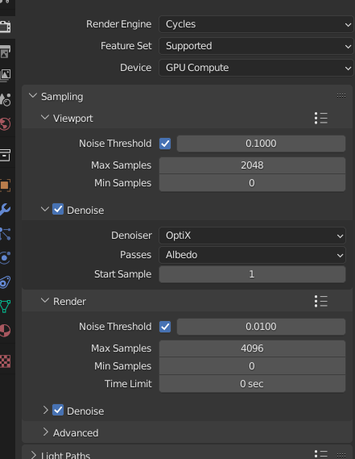 | 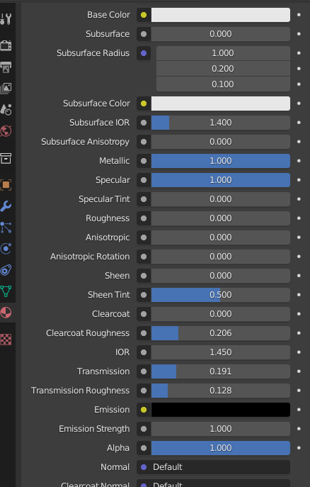 | 
|:--:|:--:|:--:|
 | <b>Fig.35 Blender Example 2</b> |<b>Fig.35 Parameter of rendering</b> | <b>Fig.35 Material parameter of cube</b> |


> The rendering parameter is set to have more sample and use the denoise provided. The material is set to have metallic and specular outlook and a few explorative adjustments of other parameters. The highly reflective surface seemingly can prevent too much noise, while some attempt of adjusting roughness can lead to much more noise.
>
> The third party software offers more possibilities of artistic adjustments and different backend, while it might be hard to debug it and sometimes slower as it is multi-functional. While a customizable renderer can be fast for some single task if well implemented. Of course it has much fewer functions. \
>
> In the cycles, we can not separate how the image is rendered, which means we can not try to see some middle results. In our framework, GPU utilization is missing and some extra functions such as denoising.


## project OptiX
| 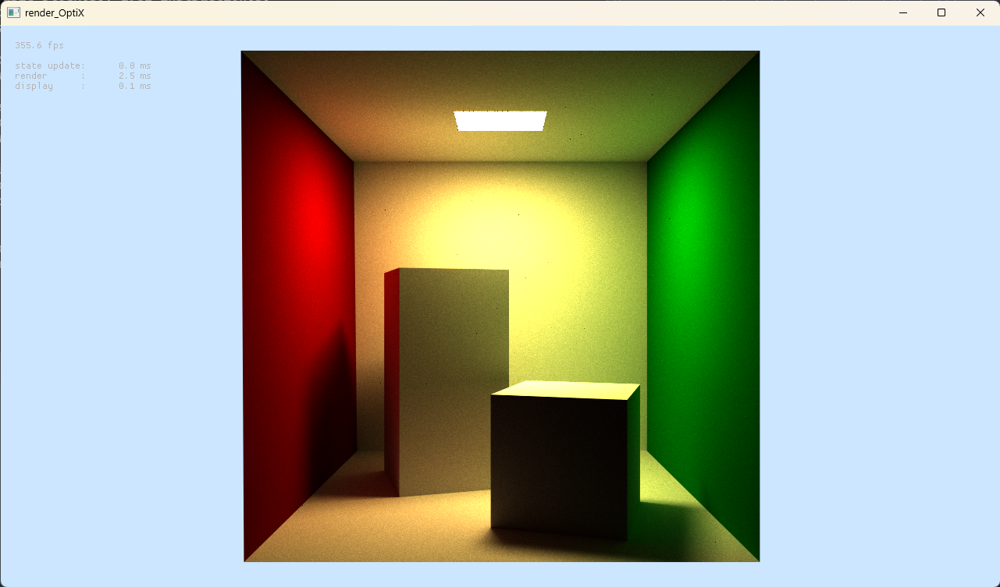 | 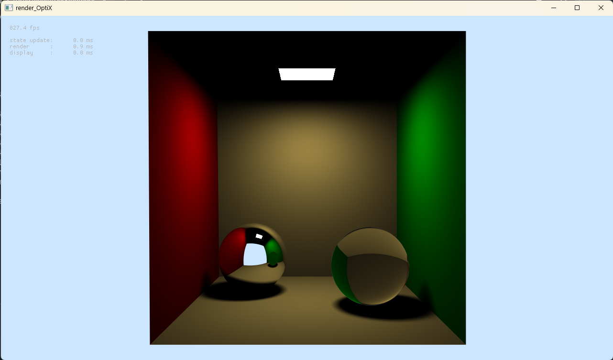 | 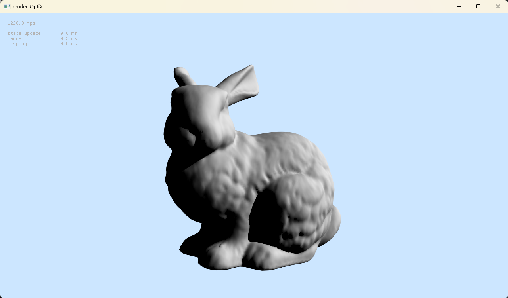 |
|:--:|:--:|:--:|
| <b></b> | <b></b> | <b></b> |

<!-- |  |
|:--:|
| <b>Fig.</b> | 

|  |  |  |
|:--:|:--:|:--:|
| <b>Fig.</b> | <b>Fig.</b> | <b>Fig.</b> |


|  |  | 
|:--:|:--:|
| <b>Fig.</b> | <b>Fig.</b> | -->